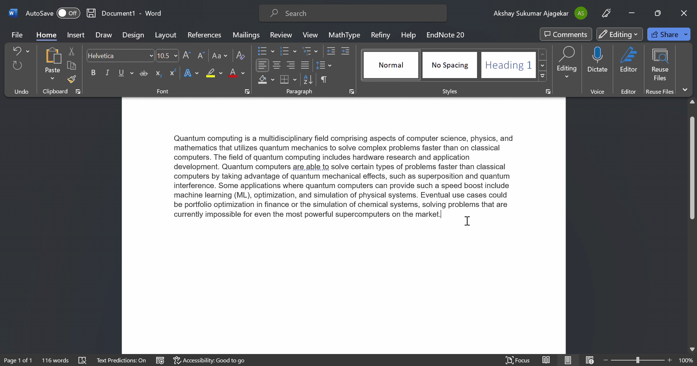
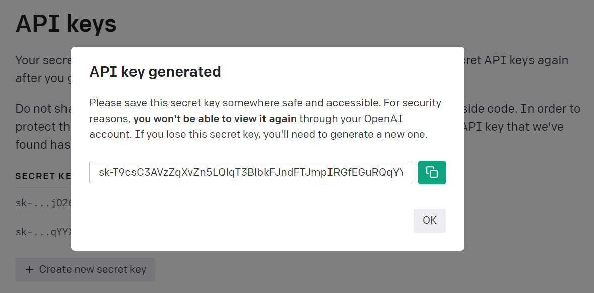
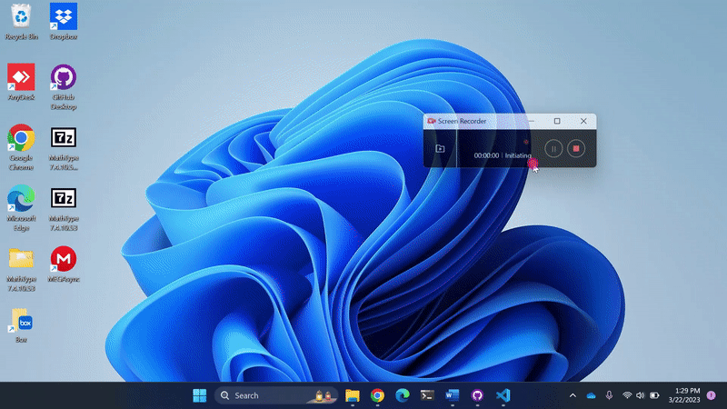
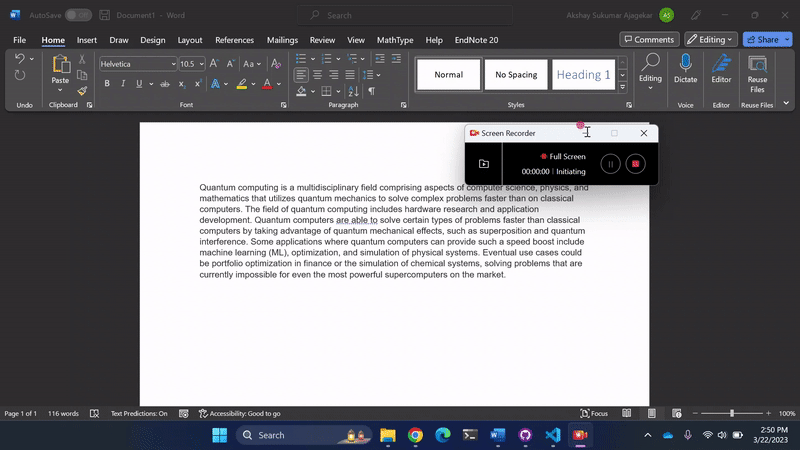
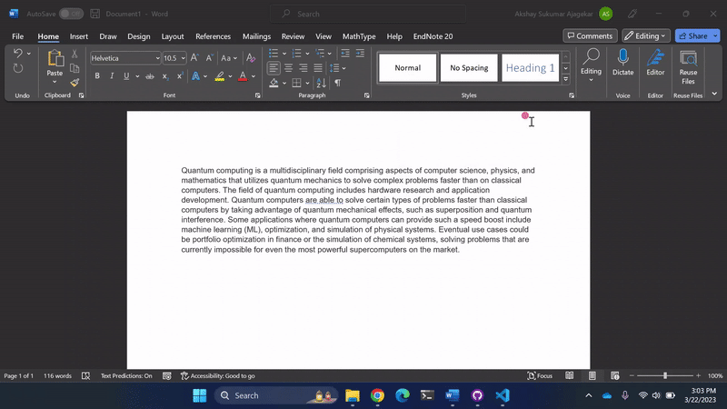
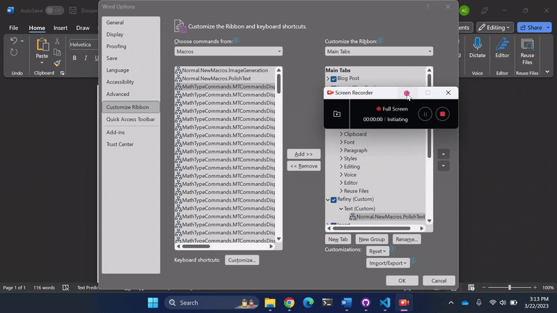
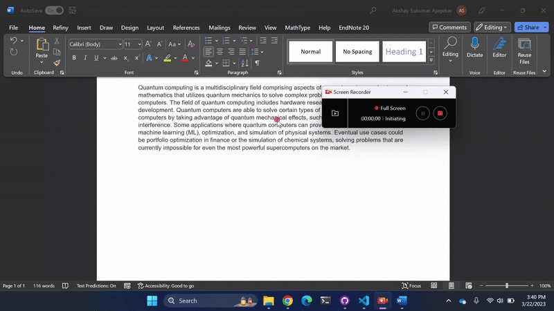

# Refiny: Polish text with OpenAI's GPT 3.5 &nbsp;
Adding OpenAI's text polishing capability to Microsoft Word
  

&nbsp;&nbsp;
&nbsp;&nbsp;

## 1. About
Improve readability of the selected text in a clear and concise manner with the click of a button in MS-Word. This is a Word macro written in VBA that communicates with the OpenAI Chat Completion API endpoint and uses the gpt-3.5-turbo which is on-par with the text-davinci-003 model for instruction-following tasks.
### OpenAI costs to consider
- Signing up for an OpenAI account provides you with **18$** free credits.
- Average manuscript size: 15,000 words -> 20,480 tokens
- Associated costs: 0.002$/1k tokens x 20,480 -> **approx. 5 cents**
- You can refine approx. 36 manuscripts 10 times for **FREE**

 

## 2. Installation
### 2.1 Obtain an OpenAI API Key

Signup for an OpenAI account at <a href="https://platform.openai.com/account/api-keys">platform.openai.com/account/api-keys</a>. Create an API key and copy the key for next steps.

 

### 2.2 Set environment variable

Create an environment variable named OPENAI_API_KEY and set its value to the API key obtained in Step 2.1.

### 2.3 Create the MS-Word macro
- Open Word (Restart if already opened) and go-to the button View -> Macros -> View Macros. 
- Create new macro named "PolishText". This opens up a MS-Vbasic Application Window.
- Delete the text in the new window and copy-paste code here from <a href="https://github.com/ajagekarakshay/Refiny/blob/main/polish.bas">polish.bas</a> file.
- Save and close the MS-Vbasic application window.

 

### 2.3 Create a separate Ribbon and Button for easy access.
- Goto File -> Options -> Customize Ribbon.
- On the right hand side, create a new tab and rename the new tab as "Refiny" and new group as "Text" (see video below).
- Select the "Macros" item in the left-hand dropdown menu and choose "PolishText".
- On the right side, select the newly created "Text" group and click on "Add" button.

- Edit the newly added item on the right if you prefer (see video below).

### 2.3 Usage: Select paragraph and click on the new button.

  

## Troubleshooting

### Security issues with running macro
- Change trust settings of macros in MS-Word (as shown below).

